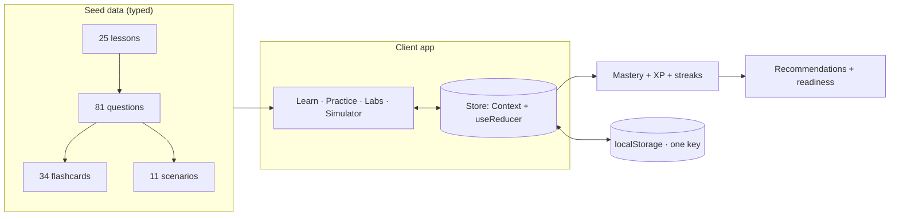

<div align="center">

# ◈ FDE AI Interview Lab

**Discover it. Build it. Ship it. Prove it.**
<br/>
An interactive learning web app for **Forward Deployed Engineer / Applied AI** interview preparation —
lessons, labs, quizzes, and a timed mock simulator in one frontend-only package.

<br/>

[](https://react.dev/)
[](https://vite.dev/)
[](https://www.typescriptlang.org/)
[](https://github.com/harshpandeyz/FDE-forward-deployed-engineer-)
[](https://github.com/harshpandeyz/FDE-forward-deployed-engineer-)

</div>

---

> **Content honesty — read first.**
> Every lesson is labeled **Verified role information** · **General industry preparation** · or **Interview prediction / practice scenario**.
> Practice questions are rehearsal only — never presented as real or internal questions from any employer.
> Nothing here guarantees an interview or job outcome, and this is not an official test.

---

## At a glance

| | |
|---|---|
| **Curriculum** | 10 phases · **25** full lessons with diagrams, code, mini-quizzes, sources |
| **Labs** | **15** functional interactives — RAG tuning, agent traces, eval charts, games, sims |
| **Practice** | **81** questions · **34** flashcards (SRS) · **11** scenarios · 10 tradeoff cards |
| **Simulator** | 12-section timed mock with transparent readiness scoring |
| **Progression** | XP · 7 levels · 12 badges · streaks · daily missions |
| **Platform** | 100% frontend · localStorage persistence · light/dark · responsive to 320px |

## Curriculum — 10 phases

| # | Phase | What you build |
|---|-------|----------------|
| 1 | **Engineering Foundations** | Python for AI, REST + status codes, SQL/NoSQL/vectors |
| 2 | **AI Foundations** | LLMs, tokens/context/cost, prompting + structured output |
| 3 | **Knowledge Systems** | Embeddings, hybrid search, RAG end-to-end, RAG eval |
| 4 | **Agentic AI** | Tool design, workflows-vs-agents, loops/planning, memory, agent eval |
| 5 | **Data Intelligence** | Data quality, taxonomies + labeling ops |
| 6 | **AI Evaluation** | Precision/recall/F1, confusion matrix, thresholds, faithfulness |
| 7 | **Infrastructure** | Docker/Compose, observability (logs · metrics · traces) |
| 8 | **System Design** | The 60-minute whiteboard method + reference architecture |
| 9 | **Forward Deployed Engineering** | Ambiguity 4-box, partner discovery, ownership |
| 10 | **Interview Masterclass** | Project stories, STAR/DRET frames, final readiness |

## The 15 labs

```
RAG Lab · Embedding Space · Agent Trace · Eval Charts · Precision/Recall Game
Data-Quality Game · Taxonomy Builder · Tool-Design Game · Workflow-vs-Agent
System-Design Sim · Docker Visualizer · API Lab · Debugging Lab
Ambiguous-Problem Lab · Partner Role-Play
```

Every control does something — tune top-K and watch retrieval change, slide a threshold and hit the PR target, assemble an architecture and get warnings, interrogate logs and name the real prod failure.

## How it works



## Readiness scoring (fully transparent)

| Competency | Weight | Fed by |
|---|:---:|---|
| Knowledge | 25% | LLM + eval mastery, self-rated confidence |
| Practical application | 25% | RAG, data, agent trajectory performance |
| AI systems | 20% | Agents + system-design mastery |
| Engineering | 15% | APIs, Python, infra, debugging |
| Communication | 15% | Self-rated clarity + project/partner work |

The simulator score is a **practice readiness estimate** — rehearsal signal, never a hiring prediction.

## Quickstart

```bash
npm install
npm run dev        # → http://localhost:5173
```

```bash
npm run build      # type-check + production bundle → dist/
npm run preview    # serve the production build
```

> Requires **Node 18+**. No env vars, no backend, no database — clone and go.

## Routes

| Route | What lives there |
|---|---|
| `/` `/dashboard` | Home · diagnostic onboarding · readiness ring · missions · streaks |
| `/learn` `/learn/:id` | Curriculum hub · full lesson engine (notes, bookmarks, mini-quiz) |
| `/practice` + `/quiz` `/flashcards` `/scenarios` `/coding` `/system-design` `/tradeoffs` `/trainer` | Quiz engine · SRS cards · scenarios · drills · answer trainer |
| `/practice/labs/*` | All 15 interactive labs |
| `/interview/simulator` | Timed 12-section mock interview |
| `/projects` `/progress` `/achievements` `/review` `/settings` | Story builder · analytics · badges · bookmarks/notes · export/reset |

## Tech

<p>
  
  
  
  
  
  
  
</p>

<details>
<summary><strong>Project structure</strong></summary>

```
src/
  main.tsx, App.tsx, index.css        # entry · route table · design tokens
  types.ts                            # Lesson / Question / UserProgress · level ladder
  store.tsx                           # global store: streaks, mastery, SRS, XP
  utils/storage.ts                    # the ONLY localStorage touchpoint
  utils/scoring.ts                    # quiz scoring · readiness weights
  components/ui.tsx                   # chips, rings, flow/architecture diagrams
  components/layout.tsx               # sidebar · search topbar · bottom nav
  data/                               # modules · lessons · questions ·
                                      # flashcards · scenarios · extras
  pages/core.tsx                      # Home · Dashboard + diagnostic · 404
  pages/learn.tsx                     # curriculum hub + lesson engine
  pages/practice.tsx                  # quizzes · flashcards · scenarios · trainer
  pages/labs.tsx, labsB.tsx           # 15 interactive labs
  pages/interview.tsx                 # timed simulator
  pages/more.tsx                      # story builder · analytics · badges ·
                                      # review · settings
```

</details>

## Persistence

One localStorage key, one `storageService` — lessons, quiz history, mastery, XP, streaks, badges, bookmarks, notes, card schedules, interview runs, missions. **Settings → Export/Import/Reset.** Nothing leaves the device.

## Roadmap

- [ ] Route-level code-splitting (current bundle ~834 KB via Recharts)
- [ ] Ordering/matching quiz types + virtualized lists
- [ ] Adversarial-doc fixtures for RAG red-teaming
- [ ] PWA offline support + unit tests for scoring/mastery

## License

Personal interview-preparation use. Lesson sources are cited per lesson; code examples are original and free to reuse.
